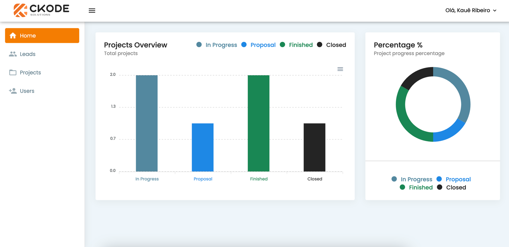
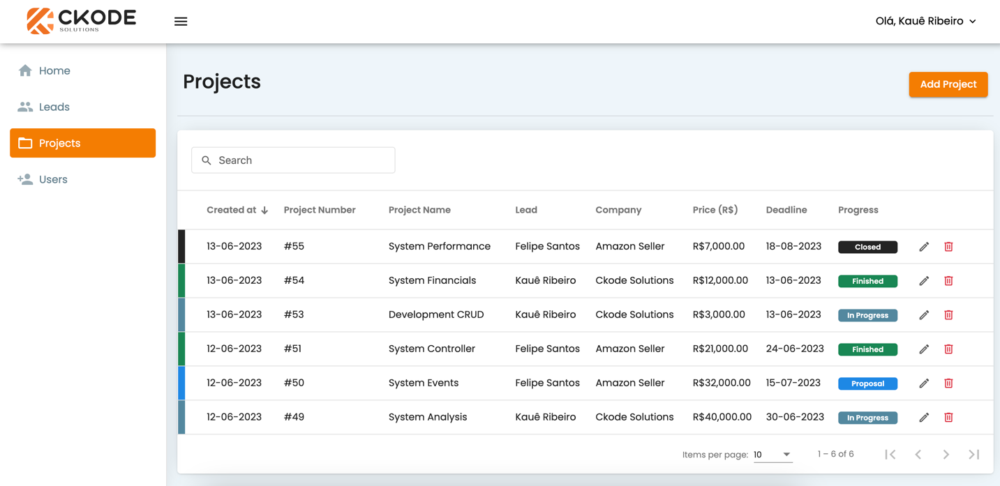

# Gestão de Leads e Planejamento de Projetos

Este projeto é uma aplicação web inicialmente criado para gerenciar leads e planejar os meus projetos pessoais. Ele fornece um ambiente centralizado onde você pode acompanhar e gerenciar leads de clientes, bem como planejar e acompanhar o progresso dos projetos.

### Login 

### Feature Home

### Feature Leads

### Feature Projects

### Feature Users

## Recursos Principais

- **Gestão de Leads**: A aplicação permite criar, visualizar, editar e excluir leads de clientes. Você pode armazenar informações importantes sobre cada lead, como nome, contato, empresa, status de negociação e notas adicionais.

- **Planejamento de Projetos**: Além da gestão de leads, o projeto também permite criar e planejar projetos. Você pode criar, visualizar, editar e excluir, podendo incluir prazos, valores e acompanhar o progresso de cada projeto.

## Tecnologias Utilizadas

O projeto foi desenvolvido utilizando as seguintes tecnologias:

- **Front-end**: HTML, CSS e Typescript usando o framework Angular com Angular Material e Bootstrap para criar a interface interativa e responsiva.

- **Back-end**: Python e o framework Django para criar a API REST que gerencia os dados de leads, projetos e usuários.

- **Banco de Dados**: MySQL foi utilizado para armazenar os dados dos leads, projetos e usuários de forma segura.

## Como Executar o Projeto

1. Clone o repositório para sua máquina local.
2. Certifique-se de ter o Node.js e Angular CLI instalados em seu sistema.
3. Instale as dependências do projeto executando `npm install` na pasta raiz do projeto.
4. Inicie o servidor executando `npm start` na pasta raiz do projeto.
5. Acesse a aplicação Frontend no seu navegador, digitando o endereço `http://localhost:4200`.

Certifique-se de que as portas mencionadas estejam disponíveis e não estejam sendo usadas por outros serviços em seu sistema.

## Contato

Se você tiver alguma dúvida ou sugestão relacionada a este projeto, entre em contato comigo em [kauedejesusrodriguesribeiro@hotmail.com](mailto:kauedejesusrodriguesribeiro@hotmail.com). Espero que este projeto seja útil para você!

